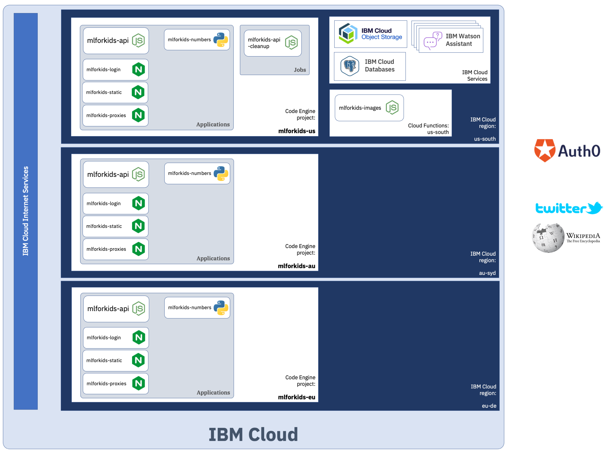
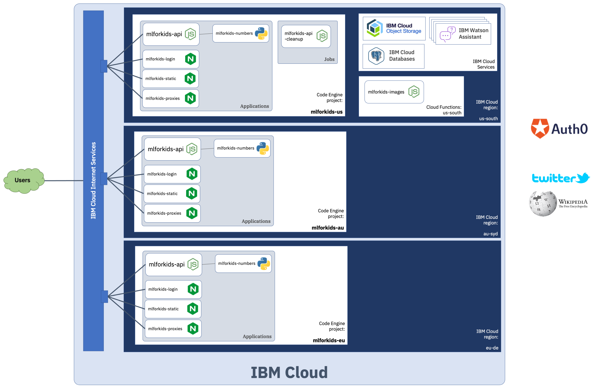
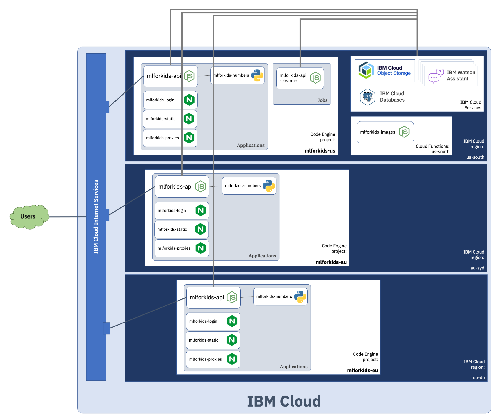
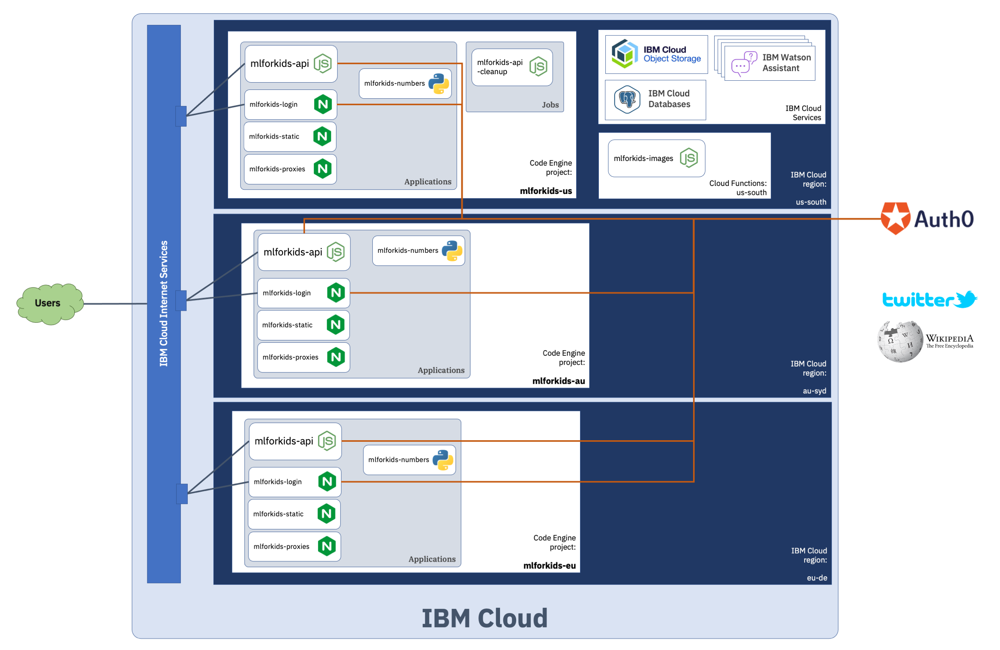
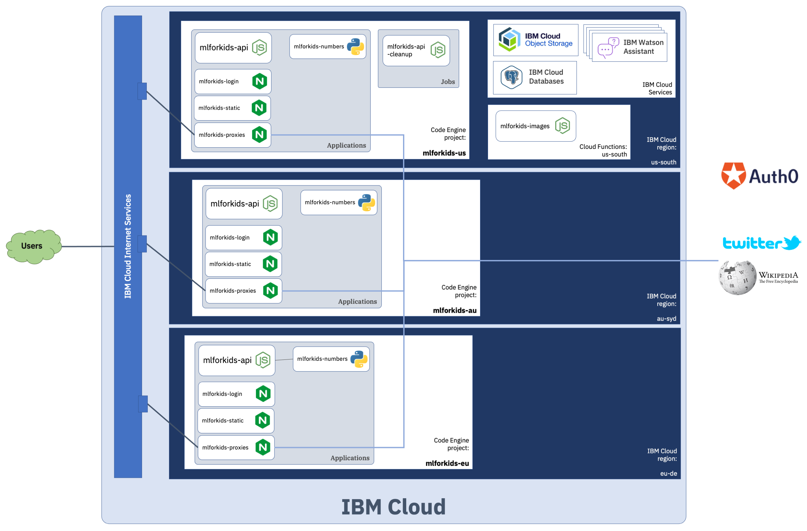

# Machine Learning for Kids production deployment

The Machine Learning for Kids site is made up of a few different pieces. This document is here to describe what they all are and where they go.

- [Machine Learning for Kids production deployment](#machine-learning-for-kids-production-deployment)
  - [The bits that make up the site](#the-bits-that-make-up-the-site)
  - [Where HTTP requests go](#where-http-requests-go)
  - [Where data lives](#where-data-lives)
  - [Where users are authenticated](#where-users-are-authenticated)
  - [Where third-party APIs are accessed](#where-third-party-apis-are-accessed)
  - [Deploying mlforkids-api to Heroku (Docker)](#deploying-mlforkids-api-to-heroku-docker)
    - [Setup Steps](#setup-steps)
    - [Minimum Configuration for Heroku](#minimum-configuration-for-heroku)
---
## The bits that make up the site

An (almost) complete set of components that makes up the Machine Learning for Kids platform is deployed into three separate regions.



| **Component**         | **Source code**                                    | **Docker image**                                                                        | **Language** | **Deployment approach** | **Purpose** |
| --------------------- | -------------------------------------------------- | --------------------------------------------------------------------------------------- | ------------ | ----------------------- | ----------- |
| mlforkids-api         | [`./mlforkids-api`](./mlforkids-api)               | [dalelane/mlforkids-api](https://hub.docker.com/r/dalelane/mlforkids-api)               | Node.js      | k8s Deployment (in Code Engine) | Main website and API              |
| mlforkids-newnumbers  | [`./mlforkids-newnumbers`](./mlforkids-newnumbers) | [dalelane/mlforkids-newnumbers](https://hub.docker.com/r/dalelane/mlforkids-newnumbers) | Python       | k8s Deployment (in Code Engine) | Creates ML models and visualisations for numbers projects |
| mlforkids-scratch     | [`./mlforkids-scratch`](./mlforkids-scratch)       | [dalelane/mlforkids-scratch](https://hub.docker.com/r/dalelane/mlforkids-scratch)       | nginx        | k8s Deployment (in Code Engine) | Hosts static parts of website that don't change frequently (i.e. Scratch fork) |
| mlforkids-proxy       | [`./mlforkids-proxy`](./mlforkids-proxy)           | [dalelane/mlforkids-proxy](https://hub.docker.com/r/dalelane/mlforkids-proxy)           | nginx        | k8s Deployment (in Code Engine) | Proxies requests from Scratch to external third-party APIs |
| mlforkids-api-cleanup | [`./mlforkids-api`](./mlforkids-api)               | [dalelane/mlforkids-api](https://hub.docker.com/r/dalelane/mlforkids-api)               | Node.js      | k8s Job (in Code Engine) | Periodic job (cron triggered every hour) to cleanup redundant data in Cloud Object Storage, and delete expired users and Watson Assistant workspaces |


---
## Where HTTP requests go

Components with external (Internet-facing) HTTP endpoints are:
- mlforkids-api
- mlforkids-scratch
- mlforkids-proxies

An instance of [Cloud Internet Services](https://www.ibm.com/cloud/cloud-internet-services) performs DNS routing - routing HTTP requests to the instance in their nearest region. (*It also manages the certificate for the machinelearningforkids.co.uk domain and performs TLS termination.*)

| **url**                              | **routed to**     | **notes** |
| ------------------------------------ | ----------------- | --------- |
| login.machinelearningforkids.co.uk   | _Auth0_           | see [Where users are authenticated](#where-users-are-authenticated) |
| machinelearningforkids.co.uk/scratch | mlforkids-scratch | *caching means most requests are served immediately from Cloud Internet Services layer* |
| proxy.machinelearningforkids.co.uk   | mlforkids-proxies |
| machinelearningforkids.co.uk         | mlforkids-api     |

*The HTTP endpoint provided by **mlforkids-numbers** is only accessible within the namespace where it is running, and is only called by the **mlforkids-api** instance in the same region as it.*

*This is described in [Deploying an application across multiple regions with a custom domain name](https://cloud.ibm.com/docs/codeengine?topic=codeengine-deploy-multiple-regions) in the Code Engine documentation.*




---
## Where data lives

Data is stored in:
- PostgreSQL database provided by [IBM Cloud Databases](https://www.ibm.com/cloud/databases) (for data relating to student ML projects)
- [Cloud Object Storage](https://www.ibm.com/cloud/object-storage) bucket for storing training data for image and sound ML projects

These are both hosted in the us-south region (this means that instances of the **mlforkids-api** application and **mlforkids-api-cleanup** job in every region all connect to storage in us-south region).

*Similarly, instances of Watson Assistant workspaces that are used to support text projects are created in the us-south region.*




---
## Where users are authenticated

Authentication is provided by a third-party service, [Auth0](https://auth0.com).

Back-end/API authentication is handled by the **mlforkids-api** service, which makes requests directly to Auth0 APIs using express middleware.

Web authentication is handled through Auth0. The `login.machinelearningforkids.co.uk` subdomain is delegated to Auth0 - with a CNAME pointing at the Auth0 servers.




---
## Where third-party APIs are accessed

Data from third-party services (Spotify and Wikipedia) is made available in Scratch through **mlforkids-proxies**. *This is an nginx proxy, and is described in more detail in a blog post on [using nginx for caching API proxies](https://dalelane.co.uk/blog/?p=3646).*



---

## Deploying mlforkids-api to Heroku (Docker)

The **mlforkids-api** service can be deployed to Heroku using the Dockerfile in `./mlforkids-api` directory with the Heroku Container Registry.

### Setup Steps

1. From the repository root, change into `mlforkids-api`:
   ```sh
   cd mlforkids-api
   ```

2. Create a Heroku app:
   ```sh
   heroku create your-app-name
   ```

3. Add Heroku Postgres addon (automatically sets `DATABASE_URL`):
   ```sh
   heroku addons:create heroku-postgresql:essential-0 -a your-app-name
   ```

4. Set required config vars (see [Minimum Configuration](#minimum-configuration-for-heroku) below):
   ```sh
   heroku config:set DEPLOYMENT=heroku AUTH0_DOMAIN=your.auth0.com -a your-app-name
   # ... set other required vars
   ```

5. Build and deploy with Docker:
   ```sh
   npm run build
   docker build -t mlforkids-api .
   heroku container:push web -a your-app-name
   heroku container:release web -a your-app-name
   ```

6. View logs to verify startup:
   ```sh
   heroku logs --tail -a your-app-name
   ```

### Minimum Configuration for Heroku

Since `DATABASE_URL` is being used, individual PostgreSQL environment variables (`POSTGRESQLHOST`, `POSTGRESQLPORT`, etc.) are automatically skipped. The Heroku Postgres addon provides `DATABASE_URL` automatically.

**Minimum required config vars** (aside from `DATABASE_URL`):
- `HOST` - Set to `0.0.0.0`
